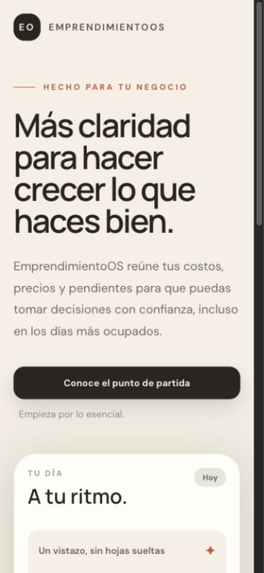
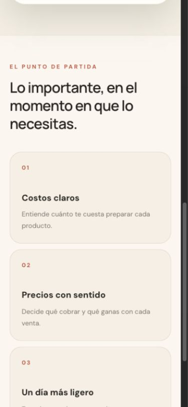
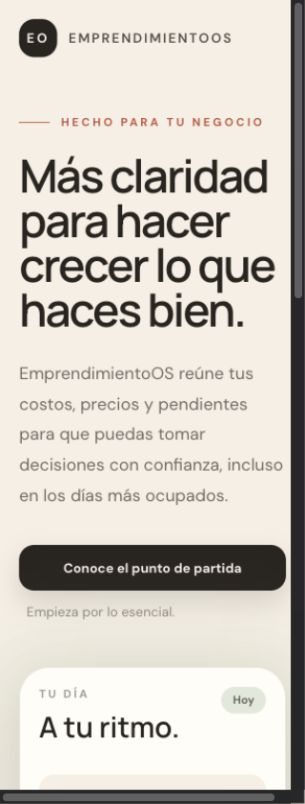

# Phase 1 · Auditoría de producto y shell

Fecha: 18 de septiembre de 2026. Producto: EmprendimientoOS v1; repositorio: RecetarioDigital.

## Alcance y autoridad

Se leyeron completas las autoridades [producto](../../PRODUCT-DEFINITION-v1.md), [arquitectura](../../ARCHITECTURE-v1.md), [principios UX](../../UX-PRINCIPLES-v1.md), [tarea](../../TSK-002-UX-UI-FOUNDATION-ASTRA.md) y el prompt TSK-002. No se detectó conflicto de alcance funcional entre ellas. El prompt agrupa el paquete final en Phase 4 y el documento rector lo separa en Phase 4–6: se adopta la numeración del rector. Ambos exigen detenerse después de tres direcciones.

Preflight: rama `tsk-002-ux-ui-foundation-astra`, HEAD `a5d498f279e1d5128b4b880ae50e81f887294d42`, origin `git@github-personal:mavalenzuela22/RecetarioDigital`. Delta previo: `docs/UX-PRINCIPLES-v1.md` modificado; prompt y documento TSK-002 sin seguimiento. Se conserva íntegro. El perfil de implementación Luna se refiere a implementación con contrato; esta ejecución está autorizada expresamente como tarea de diseño Astra, sin implementación ni promoción.

## Método y límite de la evidencia

Se inspeccionaron `Home.tsx`, CSS, entrada Inertia, controlador, ruta, vista Blade, manifest PWA y configuración de dependencias. No había un servidor Laravel escuchando. Para respetar el boundary se sirvieron **los assets compilados ya existentes del shell**, sin recompilarlos, mediante un contenedor estático Inertia bajo `docs/design/audit/shell.html`. El transporte de Laravel no se ejecutó. La composición y textos observados concuerdan con el código fuente leído; no se afirma reproducibilidad binaria del build preexistente.

Capturas de esta ejecución con el navegador de Codex, viewport solicitado 390 × 844 y 320 × 844. Las barras de desplazamiento de escritorio consumen 15 px: en 390 el ancho útil fue 375; en 320 el ancho útil fue 305. Esto limita la extrapolación del desbordamiento a un teléfono real. No hay autenticación, CRUD ni formularios en este shell. No se probaron backend, persistencia, uso sin conexión, lector de pantalla, teclado de teléfono, zoom al 200 %, manos húmedas ni operación física con una mano.

## Recorrido observado

### 1. Abrir Inicio · presentación clara, operación ausente

La pantalla contiene una promesa en español, introducción y un enlace «Conoce el punto de partida». El enlace mide 335 × 48 px y empieza a y=540 en el viewport de 390. El resumen ilustrativo aparece cerca del final de la primera pantalla, con su contenido operativo fuera de ella. No hay pedidos, nombres, fechas ni importes reales; los guiones no son estados vacíos utilizables.

### 2. Tocar la acción principal · navegación correcta, sin avance de trabajo

El enlace desplaza a `#primeros-pasos`: tres artículos explican costos, precios y pendientes. No inicia una compra ni una receta. El llamado «Registra una compra o una receta» dentro del resumen no es interactivo. Es una limitación de la etapa TSK-001, no un fallo de un CRUD existente.

### 3. Revisar ancho de 320 · requiere validación posterior

Aparece desplazamiento horizontal: `innerWidth=320`, `clientWidth=305`, `scrollWidth=320`. `body { min-width:320px }` contribuye cuando hay scrollbar reservada. No se observó desbordamiento en 390 (`scrollWidth=375`). Verificar después en 320 de ancho útil real, orientación horizontal y ampliación de texto; no declarar que todos los teléfonos de 320 fallan.

## Hallazgos priorizados

| ID | Evidencia | Hallazgo e impacto | Decisión para explorar |
|---|---|---|---|
| UX-01 · alto | Paso 1; Home.tsx:39–57 | El titular promocional domina la apertura. Una usuaria recurrente no puede decidir qué hacer con sus pedidos. | Abrir en Hoy; preparar → entregar → cobrar → estimaciones. |
| UX-02 · alto | Pasos 1–2; Home.tsx:52,80–82 | El único CTA lleva a información; la invitación a registrar aparenta acción sin ser control. | Ver producción como acción principal; Registrar compra como acceso secundario claro. |
| UX-03 · alto | Home.tsx:74–77 | Guiones sin explicación: no distinguen cero pendientes, carga, error ni falta de registros. | Diseñar estados semánticos por separado en la fase seleccionada. |
| A11Y-01 · alto | CSS:5–9; Home.tsx:41,55,75–77,99,107 | Texto coral sobre canvas ≈3.63:1; ink/50 sobre canvas ≈2.92:1; ink/60 ≈3.82:1; ink/65 ≈4.40:1. Riesgo de lectura bajo luz de cocina/exterior. | Colores de texto opacos y pares ≥4.5:1 para texto normal. |
| A11Y-02 · medio | Home.tsx:75–77 | Etiquetas de 0.68rem (10.88 px con raíz 16) y columnas angostas. «Por preparar» puede fragmentarse. | Cuerpo 16/24, auxiliares 14/20; no mini-KPIs como estructura base. |
| MOB-01 · medio | Pasos 1–2 | CTA de 48px positivo, pero una vez desplazado no hay navegación ni acción persistente. Logo 224.5 × 40px. | Navegación inferior, acciones ≥48px; guardar accesible sobre teclado y área segura. |
| MOB-02 · medio | Paso 3; CSS:20 | Scroll horizontal en entorno con barra reservada. | Contenedores fluidos sin ancho mínimo rígido; validación 320–430 en siguiente fase. |
| BRAND-01 · medio | Paso 1; Home.tsx:59–84 | Crema, salvia y tono cálido ya ayudan; tarjetas anidadas, desenfoque y motivos abstractos aún se sienten como landing genérica. | Culinaria en material, tipografía, fotos puntuales o comanda, sin competir con números. |
| MOT-01 · bajo | CSS:14–15 | Desplazamiento suave global sin excepción explícita por reducción de movimiento. | Respetar preferencia de movimiento reducido en el sistema seleccionado. |
| PWA-01 · futuro | manifest.webmanifest | Manifest tiene nombre, locale y standalone; no declara iconos. No es una PWA visualmente terminada. | Resolver icono, maskable y splash solo tras aceptación visual. |

Ratios calculados a partir de valores sRGB del código, con composición alfa explícita sobre canvas, no muestreo de píxeles. Ver [cálculos](contrast.json). No se extienden los valores a otras superficies. Las capturas por sí solas no certifican accesibilidad. Referencia: [W3C, contraste mínimo](https://www.w3.org/WAI/WCAG22/Understanding/contrast-minimum.html). El objetivo propio de 48px es más generoso que el mínimo AA de 24px y sus excepciones: [W3C, tamaño de objetivo](https://www.w3.org/WAI/WCAG22/Understanding/target-size-minimum.html).

## Fortalezas que conservar

- Español natural escrito en origen, título de página y `lang` español.
- Jerarquía semántica main/h1/h2/h3, textos de enlace descriptivos y decoración marcada `aria-hidden`.
- Tipografía sans legible en el cuerpo, CTA de 48px y apilamiento responsive.
- Paleta cálida coherente con tranquilidad y oficio; sin estereotipos ni caricaturas.
- Arquitectura ya compatible con React/TypeScript/Tailwind e Inertia; no hace falta otro framework.

## Formularios y lectura operativa: contrato, no comportamiento observado

No hay formularios que auditar. Para la exploración se fija un caso igual en A/B/C: comprar una bolsa de 1kg de harina por $42 el 18 sep 2026. La usuaria captura presentación, cantidad, unidad y total; el sistema deriva 1,000g y $0.0420/g. La precisión del costo normalizado no debe confundirse con los dos decimales de un pago.

Requisitos para refinar tras selección: etiquetas persistentes; teclado decimal; unidad junto a cantidad; fecha local por defecto; proveedor y nota opcionales plegados; errores junto al campo; conservar otros campos y borrador al regresar; envío con estado Guardando; éxito solo tras respuesta del servidor; mensaje de red con reintento sin duplicar registro. No se promete sincronización offline. Ninguna de estas conductas se declara implementada.

## Guardrails económicos

- Última compra registrada como base actual; guardar compra agrega historia, no reescribe pedidos previos.
- «Por cobrar hoy» y «Ganancia estimada» son magnitudes distintas. No sumar anticipos a saldo ni llamar ganancia al efectivo recibido.
- Separar estado de preparación/entrega del estado del pago: entregar no equivale a pagar.
- Multiplicador de costo y margen sobre precio son diferentes. El ejemplo compartido de precio se documenta con números consistentes.
- Pedidos conservan precio y costo de referencia; historial no recalcula retroactivamente con el costo nuevo.
- Sin inventario, proveedores como módulo, rutas, fiscalización, CRM ni generación de recetas por IA.

## Riesgos de decisión y verificación pendiente

A puede esconder urgencia con demasiada calma; B puede perder calidez por exceso de densidad; C puede confundir etiqueta comercial con información de pedido. Deben juzgarse con las mismas tareas y datos. Las imágenes generadas sirven para comparar estructura y carácter, no acreditan métricas CSS ni interacciones. Las especificaciones exploratorias adjuntas resuelven ambigüedades de microcopy y dinero; no constituyen un brandbook aceptado.

Después de seleccionar: validar toque con una mano, navegación, teclado, conservación de borrador, lector de pantalla, texto ampliado, reflow, estados de red y casos de fechas/pagos. La prueba de preferencia tras una semana de uso sigue pendiente por definición del producto.

Resultado de Phase 1: auditoría documental y visual del shell disponible; límites de backend y comportamiento de dominio explícitos. No se modifica producción.
