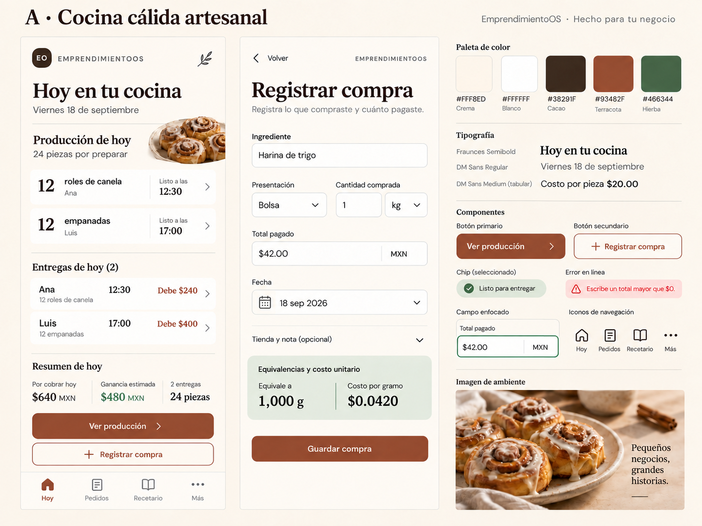

# A · Cocina cálida artesanal

**Propuesta, no autoridad final.** Agenda de cocina: producción por producto primero, entregas por hora después. La textura se sugiere por color y composición; no hay papel envejecido ni ruido detrás de importes.

- Paleta: crema `#FFF8ED`, blanco `#FFFFFF`, cacao `#38291F`, terracota `#93482F`, hierba `#466344`.
- Tipo candidata: Fraunces 600 para títulos; DM Sans 400/500/700 para cuerpo, campos y dinero. Dos familias como máximo. Familia/peso reales deben verificarse al refinar; la lámina generada es aproximación óptica.
- Superficie: radio 16px, separador cálido 1px, sin sombra dominante; el papel agrupa trabajo, no cada cifra.
- Controles: botón terracota lleno, secundario de contorno; foco opaco separado 2px. Estado con texto y símbolo.
- Iconografía propuesta: Lucide, 24px/1.75px, terminal redonda; Hoy `house`, Pedidos `clipboard-list`, Recetario `book-open`, Más `ellipsis`. Activo con fondo/indicador terracota y etiqueta, no solo cambio de tono.
- Fotografía: roles de canela sobre cerámica crema, luz lateral natural, recorte pequeño junto al producto. Fotos de referencia generadas, no fotos de productos reales. No adornar cada fila.
- Navegación: barra inferior de cuatro destinos; Ver producción y Registrar compra sobre ella. Formulario continuo con acción Guardar compra inferior.
- Compra: campos agrupados como ficha; cálculo derivado en franja hierba suave; tienda y nota plegadas. Volver conserva borrador. Unidad y cantidad permanecen juntas.

**A favor:** familiar, tranquila y cálida sin infantilizar. **Costo:** mayor extensión vertical; evitar que fotos y serif desplacen lo urgente. **Prueba pendiente:** localizar el pedido más cercano con muchos registros y una mano ocupada.

Valores, datos y estados compartidos en [comparación](../COMPARISON.md). El nombre corto «EO» es una exploración heredada del shell, no un logotipo aprobado.
