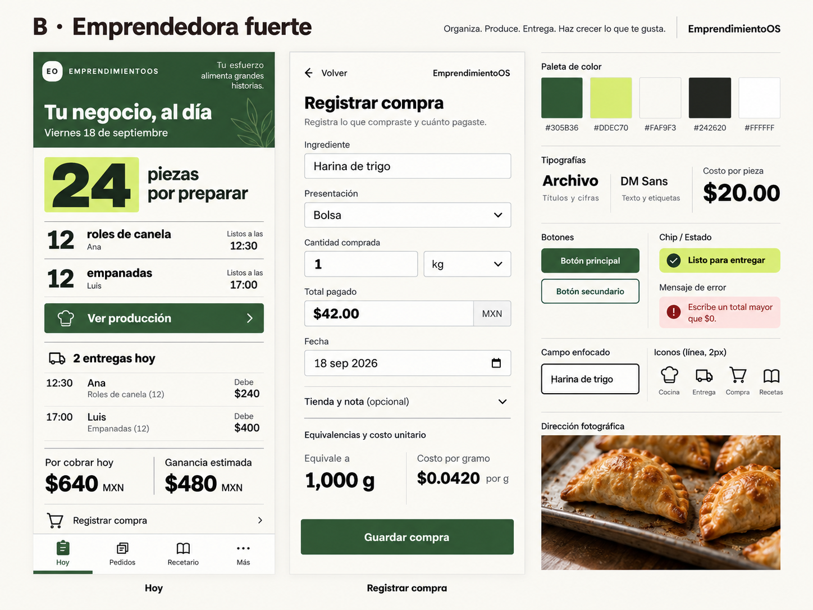

# B · Emprendedora fuerte

**Propuesta, no autoridad final.** Lista priorizada: cantidad pendiente dominante, acción Ver producción inmediata y lista de entregas debajo. La energía proviene de proporción tipográfica y orden, no de indicadores de un panel corporativo.

- Paleta: marfil `#FAF9F3`, tinta `#242620`, hierba profunda `#305B36`, lima `#DDEC70`, blanco `#FFFFFF`. Lima siempre con tinta oscura.
- Tipo candidata: Archivo 600/700 para títulos y cantidades; DM Sans 400/500/700 para lectura y campos. Importes tabulares, sin decimales diminutos.
- Superficie: radio 4px, secciones abiertas, reglas 1–2px; pocas cajas y sin sombras flotantes.
- Controles: primario verde oscuro de 52px mínimo, secundario de contorno; entrada numérica grande, foco tinta con separación visible.
- Iconografía propuesta: Lucide 24px/2px; mismos cuatro significados que A, activa mediante banda sólida y etiqueta. Trazo más firme y menor redondeo de contenedores.
- Fotografía: empanadas en bandeja de producción con papel sin blanquear, recorte franco y luz natural; la imagen acompaña el oficio y no ocupa el trabajo principal.
- Navegación: mismo mapa común; encabezado compacto y CTA de tarea cerca de la cantidad. Sin gestos ocultos ni deslizar como única manera de cambiar un estado.
- Compra: formulario compacto continuo, grupos de ingrediente y dinero separados por regla; recibo calculado sin tarjeta ornamental. El teclado determina scroll, no reduce campos.

**A favor:** lectura rápida y sensación de control. **Costo:** necesita cuidado para conservar calidez y no comprimir. **Prueba pendiente:** legibilidad de auxiliares, fatiga visual y tono con uso prolongado.

Ver [comparación](../COMPARISON.md); ningún peso, activo o componente está aprobado para producción.
