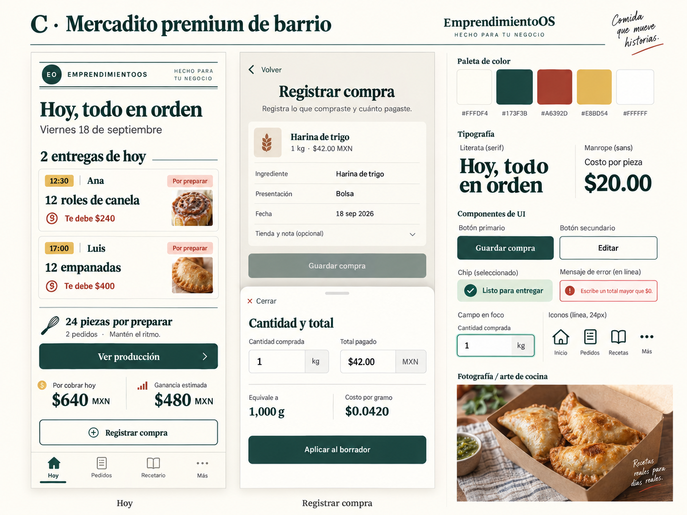

# C · Mercadito premium de barrio

**Propuesta, no autoridad final.** Comandas por persona y hora: primero la entrega concreta, con preparación agregada al alcance. El carácter local aparece en las etiquetas y el cuidado editorial, sin caricaturas de barrio ni estética de lujo.

- Paleta: papel `#FFFDF4`, verde mercado `#173F3B`, guayaba `#A6392D`, mostaza `#E8BD54`, blanco `#FFFFFF`. Mostaza solo como fondo con tinta oscura.
- Tipo candidata: Literata 600 para encabezados breves; Manrope 400/500/700 para interfaz y cifras.
- Superficie: radio 8px; comandas como objetos independientes, reglas 1px. No anidar tarjetas ni aplicar textura detrás de cantidades.
- Controles: primario verde, contorno verde para editar; etiquetas rectangulares, foco visible opaco. No usar rojo de marca como único indicador de error.
- Iconografía propuesta: Lucide 24px/2px dentro de áreas amplias; indicador activo de etiqueta/subrayado. No inventar símbolos culinarios para cobros o borrar.
- Fotografía: producto realista en empaque sencillo sin marcas ajenas; encuadre limpio como etiqueta editorial, fruta o ingrediente secundario sin tapar texto.
- Navegación: cuatro destinos comunes; las comandas abren detalle, nunca marcan cobro/entrega al tocar la tarjeta. Siempre hay nombre, hora y saldo explícitos.
- Compra: resumen editable por bloques con hoja inferior para cantidad, unidad e importe. La lámina muestra una edición; Aplicar actualiza borrador y Guardar compra confirma toda la compra. Regresar desde la hoja conserva los demás datos. El cierre no guarda silenciosamente.

**A favor:** asociación directa de trabajo con cliente y entrega, personalidad reconocible. **Costo:** la edición por bloques añade una decisión; muchas comandas pueden alargar Hoy. **Prueba pendiente:** comprensión de Aplicar frente a Guardar compra, y crecimiento de dos a veinte pedidos. Si exige explicación verbal, simplificar a formulario continuo conservando la identidad.

Ver [comparación](../COMPARISON.md). No hay catálogo público, marketplace ni gestión de proveedores propuestos.
