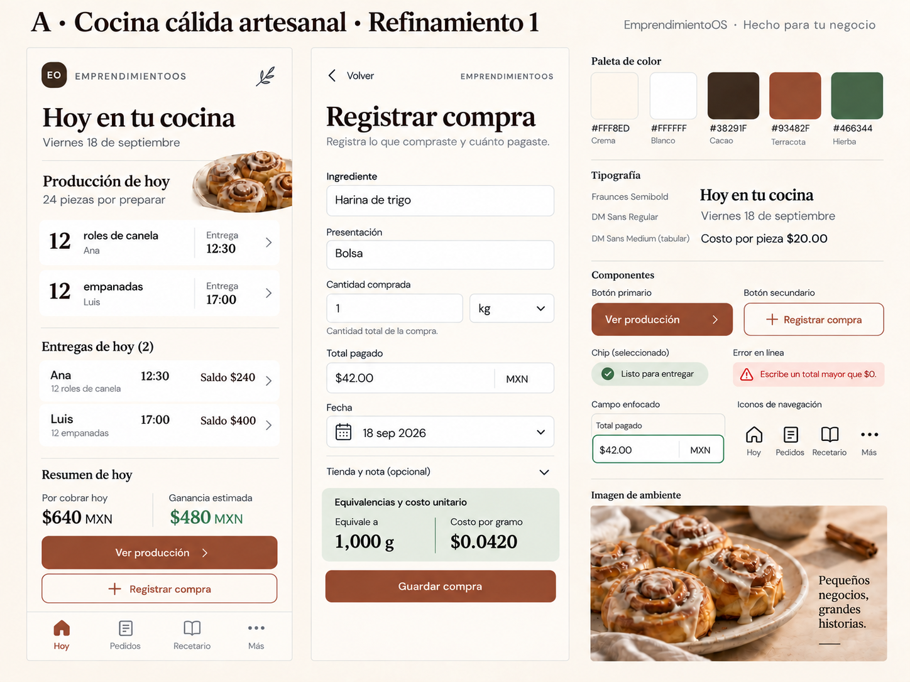

> Registro histórico de esta fase. Estado final: A refinada aceptada; paquete completo. Véase docs/design/README.md.

# A · Cocina cálida artesanal · Refinamiento 1

**Phase 3. Dirección seleccionada; aceptación de esta versión pendiente.**

## Selección recibida

El operador comunicó: «La patrona dice que le gustó la opción A. Cocina cálida artesanal». Se registra A como dirección elegida para refinar. No se interpreta como aceptación anticipada de cambios que aún no había visto, ni como cierre de TSK-002.

Se conserva la comparación original A/B/C como historial. B y C no se mezclan con A ni se desarrollan en esta iteración. El maestro original A permanece sin sobrescribir.

## Referencia visual

## Qué se conserva

Crema, cacao, terracota y hierba; encabezados serif y cuerpo sans; superficies suaves y limpias; fotografía de canela; agenda con producción y entregas; navegación Hoy/Pedidos/Recetario/Más; registro continuo de compra. La cantidad de trabajo y los importes mantienen el caso compartido de Phase 2.

## Ajustes de esta revisión

| Elemento | Antes | Intención del refinamiento |
|---|---|---|
| Hora del producto | «Listo a las» | «Entrega»: evita confundir un compromiso horario con trabajo terminado. |
| Deuda vigente | «Debe» en rojo | «Saldo» en cacao: pendiente no significa vencido. |
| Resumen económico | Tres columnas, una repetía piezas/entregas | Dos columnas para dar espacio a Por cobrar hoy y Ganancia estimada. |
| Presentación de compra | Selector junto a cantidad y unidad | Texto libre en fila propia; la descripción no exige un catálogo. |
| Cantidad comprada | Espacio angosto | Fila propia con unidad y ayuda «Cantidad total de la compra». |
| Error de importe | Rojo brillante y fino | Texto rojo oscuro sobre fondo claro, acompañado de icono. |

La compra sigue siendo una bolsa de 1kg por $42.00 MXN → 1,000g → $0.0420/g. Guardar añade un registro histórico; no crea inventario ni reescribe los costos de pedidos anteriores. La moneda no es un selector. El calendario del ejemplo se conserva para comparar versiones, no representa datos de operación reales.

## Revisión pendiente con el operador

Esta es una revisión visual de dos pantallas. No se ha construido el brandbook, prototipo funcional, sistema completo de componentes ni exportaciones de marca. La imagen generada no demuestra tamaño táctil, identidad tipográfica exacta, conservación de formularios o accesibilidad completa. Las medidas candidatas permanecen en `exploration/candidates.json` como intención.

La siguiente decisión es aceptar explícitamente esta dirección refinada o indicar cambios. Si se acepta, continuar Phase 4–6 conforme al documento rector; si no, permanecer en Phase 3. El comentario inicial de preferencia no se convierte en aprobación automática del refinamiento.

## Verificación de la lámina

Se inspeccionó la salida generada: los dos horarios dicen Entrega, ambos saldos son neutrales, el resumen tiene dos columnas y presentación/cantidad tienen filas separadas. Se conservan importes, cuatro decimales del costo normalizado y navegación. El color exacto del mensaje de error sigue siendo intención de diseño; el raster no certifica el valor hex ni contraste de todos los estados. Maestro entregado: 1448 × 1086 px, sin ampliación artificial.
